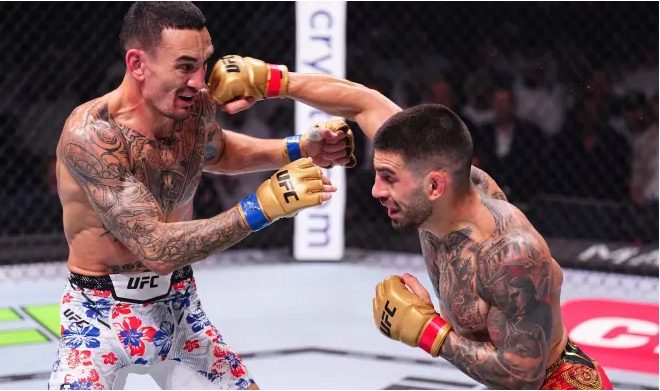
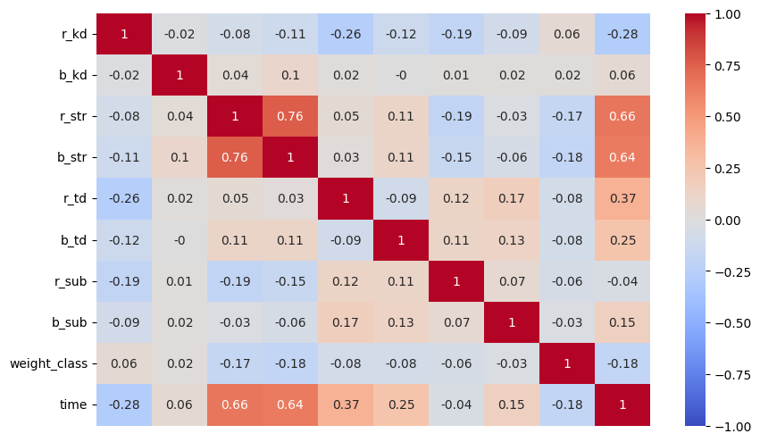
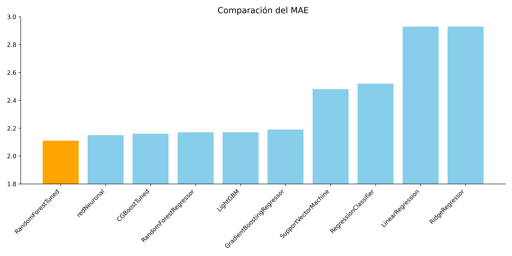
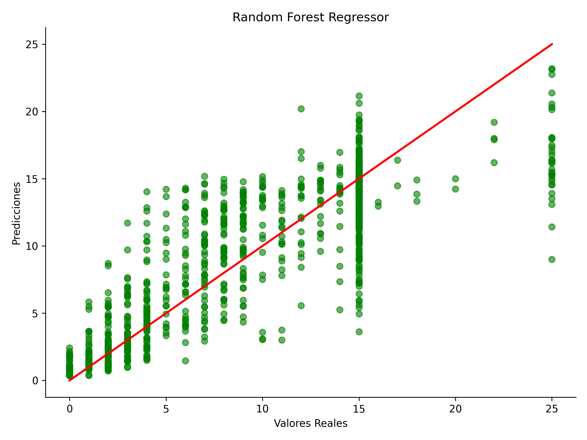
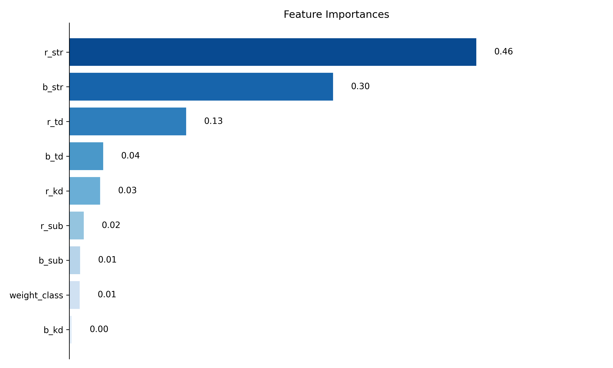

#  **Predicción de Duración de Combates en UFC 🥋**

  

## ✍️ **Descripción del Proyecto**

En este proyecto, desarrollamos un modelo de **Machine Learning** para predecir de manera precisa cuántos **rounds** y **minutos adicionales** tendrá un combate.  

Utilizamos un dataset de **Kaggle** con **7,600 registros** y **18 variables**, que incluye información sobre enfrentamientos de peleadores y métricas relacionadas.  

📊 Aplicamos **técnicas de Feature Engineering** para mejorar las variables predictoras y visualizamos las correlaciones entre estas utilizando el coeficiente de **Pearson**.

  

---

## 🚀 **Modelos Entrenados**

Probamos múltiples algoritmos para seleccionar el modelo con el **MAE (Mean Absolute Error)** más bajo posible.  

### ✅ **Modelos Supervisados**
- 🤖 **Red Neuronal**  
- 🌟 **XGBoost Tuned**  
- 🌳 **Random Forest Regressor**  
- ⚡ **LightGBM**  
- 📈 **Gradient Boosting Regressor**  
- 🧠 **Support Vector Machine**  
- 🌲 **Decision Tree Regressor**  
- 🧮 **Linear Regression**  
- 🔗 **Ridge Regressor**

### 🔍 **Modelos No Supervisados**
- 🔗 **K-Means**  
- 📊 **PCA (Análisis de Componentes Principales)**

  

---

## 🏆 **Modelo Final Seleccionado**  
Finalmente, seleccionamos un 🌳 **Random Forest Regressor** como el modelo con mejor desempeño.  
Adjuntamos la línea de tendencia enfrentando el valore real respecto al predicho.

  

📌 **Variables que tienen mas peso en el modelo**:  

  

---
  
### **Impacto en el Negocio**
El tiempo de un combate tiene un impacto directo en los ingresos y la experiencia del evento. Algunas posibles transformaciones del tiempo en valor incluyen:  

  

- ⏳ **Más anuncios entre rounds:** Combates más largos permiten incluir más cortes comerciales, incrementando las ganancias por publicidad.  

- 🎭 **Mejora del espectáculo:** La predicción precisa de la duración ayuda a optimizar la planificación de veladas, asegurando que sean más atractivas y entretenidas para el público.  

- 🏟️ **Optimización logística:** Conocer la duración promedio de los combates puede optimizar el uso del lugar del evento, reduciendo costos o aumentando el retorno de inversión.  

- 🎲 **Mejora en las apuestas:** Una predicción más precisa mejora la experiencia de usuario en las casas de apuestas, incrementando la confianza y la fidelidad de los apostadores.  

- 🥊 **Preparación de peleadores:** Al conocer de antemano cuánto puede durar un combate, los peleadores pueden ajustar su estrategia y entrenamiento, incrementando la calidad de los enfrentamientos.  

---

## 🛠️ **Próximos Pasos**

  

1. ✨ **Mejorar el Feature Engineering**: Refinar las variables existentes e incluir interacciones entre características.  

2. 🧪 **Probar nuevos modelos**: Evaluar alternativas o combinaciones para optimizar el desempeño. 

3. 🔄 **Incluir nuevas variables**: Incorporar datos adicionales que puedan mejorar las predicciones. 

4. 🤖 **Explorar técnicas de Deep Learning**: Probar redes neuronales profundas para capturar patrones complejos.  

5. 🗣️ **Obtener Feedback de Negocio**: Validar el modelo con stakeholders para asegurar su utilidad en contextos reales.  

6. 🌐 **Desplegar el modelo con Streamlit**: Crear una interfaz interactiva para probar el modelo y permitir su uso práctico.

---
&nbsp;

## 📂 **Contenido del Repositorio**

El repositorio incluye las siguientes carpetas y archivos principales:  

### 📁 **app_streamlit**  
- `app.py`: Script para desplegar el modelo en Streamlit.  
- `requirements.txt`: Especifica las versiones de las bibliotecas necesarias para el entorno.  

### 📁 **data**  
- `images/`: Carpeta con imágenes utilizadas en visualizaciones o reportes.  
- `data_processed/`: Datos procesados para el entrenamiento del modelo.  
- `raw_data/`: Datos originales sin procesar.  
- `data_test/`: Conjunto de datos para pruebas finales.  
- `data_train/`: Conjunto de datos utilizado para entrenamiento.  

### 📁 **docs**  
- `presentacion_negocio.pdf`: Presentación enfocada en los aspectos de negocio.  
- `presentacion_tecnica.pdf`: Presentación detallada de aspectos técnicos del proyecto.  

### 📁 **models**  
- `ufc_model.pkl`: Modelo final entrenado listo para ser utilizado.  
- `model_config.yaml`: Archivo de configuración con los parámetros y metadatos del modelo.  

### 📁 **notebooks**  
- `fuentes.ipynb`: Análisis y exploración de fuentes de datos.  
- `limpieza.ipynb`: Proceso de limpieza y transformación de los datos.  
- `entrenamiento.ipynb`: Entrenamiento y evaluación de los modelos.  

### 📁 **src**  
- `data_processing.py`: Funciones para preprocesar los datos.  
- `evaluation.py`: Métricas y evaluaciones del desempeño del modelo.  
- `training.py`: Scripts para entrenar los modelos de Machine Learning.  

