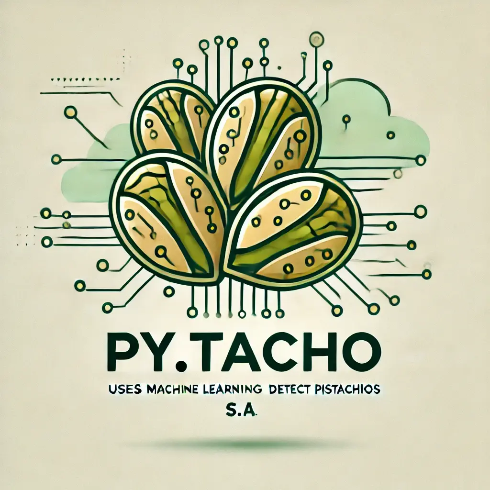
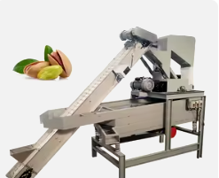
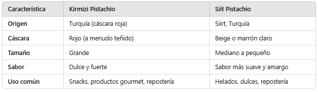
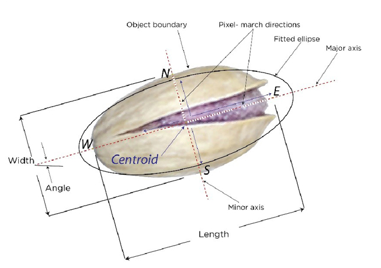
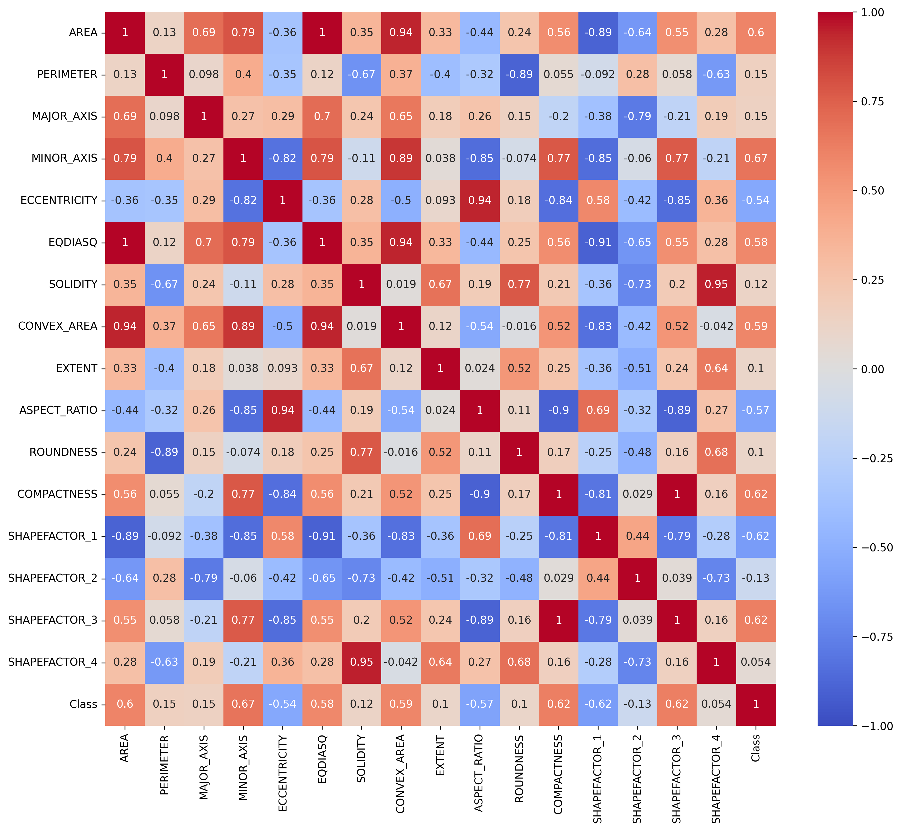

  

&nbsp;

<h1 style="text-align: center;">🌱 Proyecto de Mejora en el Proceso de Selección de Pistachos 🌱</h1>

**PyTachos S.A.** es mi empresa ubicada en Mérida, dedicada al procesamiento y selección de pistachos de alta calidad.  
Hemos abierto una nueva línea de inversión para mejorar la **CLASIFICACIÓN** de nuestros productos.

&nbsp;

🔍 **Disponemos de un óptico láser** que actualmente solo contabiliza la **CANTIDAD** de pistachos que pasan por las cintas transportadoras.

  

&nbsp;  

## ¿Handicap?

Compramos pistachos de alta calidad en Turquía, pero el **PROBLEMA** surge cuando recibimos dos variedades muy similares mezcladas cuando se hace la compra al por mayor.

<h2 style="text-align: center;">🥜 Tipo de pistachos 🥜</h2>

 

  

&nbsp;

✨ Queremos implementar un modelo de **machine learning** para tener una buena detección de las variedades específicas de pistachos que compramos.

&nbsp;

## 🔬 ¿Cómo obtenemos las métricas del pistacho?
- Mediante el **PROCESADO DE IMAGEN** que nos proporciona el óptico, obtenemos métricas detalladas como ancho, largo, ángulo, etc.

  

## ¿Hay correlación entre las variables? 📊

  

## Roadmap del proyecto

1. **📈 Recopilación de Datos**: Captura de datos con el óptico.
2. **🧹 Preprocesamiento de Datos**: Limpieza de datos y agrupación.
3. **🤖 Entrenamiento del Modelo**: Pruebas con diferentes pipelines de machine learning.
4. **⚙️ Implementación**: Desarrollo e integración del software.

## ✨ Conclusión

- Con la integración del modelo de machine learning, **PyTachos S.A.** se posicionará a la vanguardia en la industria de selección de pistachos, ofreciendo dos líneas de productos de la más alta calidad.
- Estamos comprometidos con la innovación y la mejora continua para garantizar que nuestros clientes siempre reciban lo mejor.

## Contacto

Si deseas más información sobre nuestros productos y el proceso de selección, no dudes en contactarnos.

- **🌐 Sitio Web**: [www.pytachos.com](http://www.pytachos.com)
- **✉️ Correo Electrónico**: contacto@pytachos.com
- **📞 Teléfono**: +123 456 789

